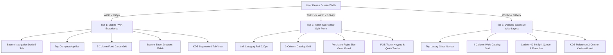

# CELVASS RESTO & BAR — SPECIFIKASAUN TÉKNIKA & MATRIKS LAYOUT RESPONSIF PWA MULTI-DEVICE (UI.MD)

> **Document Status**: Production Blueprint & Engineering Architecture Specification  
> **Target Version**: v2.1.0 Multi-Device Adaptive Layout  
> **Audience**: Junior Developers, AI Coding Agents, Frontend Engineers, QA Testers  
> **Design Language**: Ultra-Luxury Dark Glassmorphism (`#090500` obsidian mesh, 24px blur, radiant amber-orange accents)  
> **Target Devices**: Mobile Smartphones (< 768px), Tablets / iPads (768px – 1024px), Desktop / Laptops (> 1024px)  
> **Reference Benchmarks**: Instagram PWA, TikTok PWA, Gojek / Tokopedia Consumer App, Square POS / Toast POS Tablet Kanban  
> **Target Jurisdiction**: Dili, Timor-Leste (Base Language: Tetun Prasa)  

---

## ÍNDISE / TABLE OF CONTENTS
1. [Vizaun Jerál & Paradigma Layout Responsif PWA](#1-vizaun-jerál--paradigma-layout-responsif-pwa)
2. [Analiza Kesenjangan Layout Atual (Current Layout Gap Analysis)](#2-analiza-kesenjangan-layout-atual-current-layout-gap-analysis)
3. [Arsitektura Breakpoint 3-Tier (Mobile, Tablet, Desktop Matrix)](#3-arsitektura-breakpoint-3-tier-mobile-tablet-desktop-matrix)
4. [Spesifikasaun Mobile Bottom Navigation Dock (Gojek / Tokopedia Style)](#4-spesifikasaun-mobile-bottom-navigation-dock-gojek--tokopedia-style)
5. [Tata Letak Katalog Menu & Kartu Makanan Adaptif](#5-tata-letak-katalog-menu--kartu-makanan-adaptif)
6. [Tata Letak Portal Staff (Cashier POS & Kitchen KDS Tablet vs Desktop)](#6-tata-letak-portal-staff-cashier-pos--kitchen-kds-tablet-vs-desktop)
7. [Inventaris Problema Tékniku (Technical Issues) & Solusaun Konkretu](#7-inventaris-problema-tékniku-technical-issues--solusaun-konkretu)
   - 7.1. [Problema 100vh Viewport Jumping iha iOS & Android (dvh / svh Solution)](#71-problema-100vh-viewport-jumping-iha-ios--android-dvh--svh-solution)
   - 7.2. [Problema Notch & Home Indicator iPhone (Safe-Area-Inset Protocol)](#72-problema-notch--home-indicator-iphone-safe-area-inset-protocol)
   - 7.3. [Problema Kolizaun Floating Cart Bar ho Bottom Navigation Dock](#73-problema-kolizaun-floating-cart-bar-ho-bottom-navigation-dock)
   - 7.4. [Problema Kitchen KDS 3-Kolom Terhimpit iha Mobile](#74-problema-kitchen-kds-3-kolom-terhimpit-iha-mobile)
   - 7.5. [Problema Touch Target Sizing (< 48px) & Ergonomi Jempol](#75-problema-touch-target-sizing--48px--ergonomi-jempol)
   - 7.6. [Problema Scroll Chaining & Double Scrollbar iha Modal / Offcanvas](#76-problema-scroll-chaining--double-scrollbar-iha-modal--offcanvas)
8. [Cetak Biru Kode Implementasi Kompletu (File-by-File Implementation Blueprint)](#8-cetak-biru-kode-implementasi-kompletu-file-by-file-implementation-blueprint)
   - 8.1. [Modifikasaun `static/css/style.css`](#81-modifikasaun-staticcssstylecss)
   - 8.2. [Modifikasaun `templates/base/base.html`](#82-modifikasaun-templatesbasebasehtml)
   - 8.3. [Modifikasaun `templates/customer/index.html`](#83-modifikasaun-templatescustomerindexhtml)
   - 8.4. [Modifikasaun `templates/customer/tracker.html`](#84-modifikasaun-templatescustomertrackerhtml)
   - 8.5. [Modifikasaun `templates/cashier/dashboard.html`](#85-modifikasaun-templatescashierdashboardhtml)
   - 8.6. [Modifikasaun `templates/kitchen/kds.html`](#86-modifikasaun-templateskitchenkdshtml)
   - 8.7. [Modifikasaun Javascript Controllers (`customer.js`, `cashier.js`, `kitchen.js`)](#87-modifikasaun-javascript-controllers-customerjs-cashierjs-kitchenjs)
9. [Matriks Verifikasaun & Panduan QA Testing Multi-Device](#9-matriks-verifikasaun--panduan-qa-testing-multi-device)

---

## 1. VIZAUN JERÁL & PARADIGMA LAYOUT RESPONSIF PWA

Sistema PWA (Progressive Web App) Celvass Resto & Bar la bele uza layout ne'ebé hanesan de'it iha tela hotu-hotu. Bainhira kliente ka staff loke sistema iha:
1. **Smartphone (Mobile Phone)**: Uzuáriu uza liman-fuan ida (jempol/thumb). Presiza **Bottom Navigation Dock** hanesan aplikasaun nativu Instagram, Gojek, ka Tokopedia, header ne'ebé kompak, no kartaun menu ne'ebé fahe ba koluna 2 (2-column compact grid) atu haree hahan barak liu lahó scroll naruk demais.
2. **Tablet / iPad (768px – 1024px)**: Tela luan liu maibé uza touch screen. Presiza **Split-Pane Layout** (ezemplu: lista kategoria iha karuk, katalogu iha klaran, no resumo pedidu/konta iha kuana hanesan sistem POS Square ka Toast).
3. **Laptop / PC Desktop (> 1024px)**: Uza mouse no keyboard. Presiza layout multi-koluna luan ho visualizasaun foto hahán boot, painél kontrolu kasir ho fahe 40%-60%, no ekrã KDS dapur ho kanban board 3 koluna fiksa.

Estétika vizuál **Ultra-Luxury Dark Glassmorphism** (fundo obsidian `#090500`, blur 24px, borda suave, naroman oranje-amber `#f97316`) tenke mantein 100% konsistente iha plataforma hotu, maibé **tata letak (layout), pozisaun navegasaun, no dimensaun komponen tenke transmuta tuir ergonomia devaisu ida-idak**.

---

## 2. ANALIZA KESENJANGAN LAYOUT ATUAL (CURRENT LAYOUT GAP ANALYSIS)

| Área UI | Kondisaun Atual (Existing) | Problema Ergonomia / UX | Solusaun Padraun PWA v2.1.0 |
| :--- | :--- | :--- | :--- |
| **Mobile Navigation** | Navbar desktop tradisional iha leten ho tombol hamburger | Liman-fuan susar to'o leten (out of thumb reach zone); bainhira hamburger loke, taka menu hotu | **Bottom Navigation Dock** fiksa iha kraik (5 tabs: Menu, Buka/Kategoria, Karreta ho badge, Status Pedidu, Info/Konta) |
| **Mobile Food Grid** | 1 koluna luan (col-md-4 col-sm-6) hodi halo scroll naruk tebes | Kliente presiza scroll saugati atu haree menu 5-10; foto boot demais iha tela ki'ik | **2-Column Responsive Compact Card** iha mobile (< 768px) ho altura foto 130px-145px |
| **Mobile Cart Drawer** | Offcanvas boot mai hosi kraik maibé to'o de'it 80vh | Butaun konfirma pedidu dala ruma subar iha kraik telemóvel ne'ebé iha home indicator bar (iPhone gesture line) | Aplika `padding-bottom: env(safe-area-inset-bottom)` no integra butaun checkout ho floating cart bar |
| **Tablet View (iPad)** | Layout mobile ne'ebé de'it maibé hekik sai luan (stretched) | Espasu luan iha sorin karuk no kuana mamuk; kasir presiza loke-taka modal hodi haree item | **Master-Detail Split-Pane**: Karuk = Kategoria / Meza, Klaran = Menu, Kuana = Resumo Konta / Order Ticket |
| **Kitchen KDS Mobile** | 3 koluna kanban sulan hamutuk iha ekran 380px | Koluna ida-idak sai kloot tebes (110px), teks la bele lee, butaun tein monu sai hosi frame | **Segmented Tab Switcher** iha mobile: Tab 1 (Foun), Tab 2 (Tein Hela), Tab 3 (Prontu); Kanban 3-koluna de'it ba Tablet/PC |
| **Touch Targets** | Butaun ki'ik balun iha medida 32px – 36px | Fasil hanehan sala (misclick / fat-finger syndrome), liuliu ba kasir ne'ebé atende lalais | Aumenta touch target área minimu **48x48px** tuir padraun W3C WCAG 2.1 AAA |

---

## 3. ARSITEKTURA BREAKPOINT 3-TIER (MOBILE, TABLET, DESKTOP MATRIX)

Aplikasaun sei uza matadalan media query 3-Tier ho komportamentu estruturál tuir mai:



### Matriks Komparasaun Komponen tuir Breakpoint:

| Komponen UI | Tier 1: Mobile (< 768px) | Tier 2: Tablet (768px – 1024px) | Tier 3: Desktop (> 1024px) |
| :--- | :--- | :--- | :--- |
| **Top Navigation** | Kompak (Logo ki'ik, Table Badge, Language Dropdown) | Hybrid (Logo, Table Status, Quick Actions) | Full Navbar (Logo, Portal Links, Status, Profile) |
| **Bottom Navigation** | **Aktivu (Bottom Dock 5 Tabs)** | Dezativu (Omitidu) | Dezativu (Omitidu) |
| **Grid Menu Hahán** | **2 Koluna** (card-compact, foto 135px) | **3 Koluna** (card-standard, foto 160px) | **4 Koluna** (card-luxury, foto 185px) |
| **Kategoria Menu** | Horizontal Pill Scrollbar (swipe liman) | Vertical Left Rail (200px) ka Top Pills | Horizontal Pills / Mega-Filter Bar |
| **Karreta (Cart)** | Floating Pill Dock + Bottom Sheet 85dvh | Persistent Slide-Over Right Panel (320px) | Floating Bottom Bar ka Persistent Right Rail |
| **Kasir (POS)** | Tabbed View (Queue -> Meza -> POS Modal) | Split View (Lista Meza 50% + POS Checkout 50%) | 2-Koluna Asimetriku (Queue 38% + Floorplan 62%) |
| **Dapur (KDS)** | Segmented Pills (1 Koluna kada Tab) | 3-Koluna Kanban (Landscape view obrigatóriu) | 3-Koluna Kanban Fullscreen 100vh |
| **Safe Area Inset** | `env(safe-area-inset-bottom)` obrigatóriu | Opcional | La presiza |

---

## 4. SPESIFIKASAUN MOBILE BOTTOM NAVIGATION DOCK (GOJEK / TOKOPEDIA STYLE)

### 4.1. Anatomia & Pozisaun
Iha ekran mobile (< 768px), navbar leten la bele domina tela tanba foti espasu boot demais. Top bar sei sai minimalistu, no navegasaun prinsipál muda ba **Bottom Navigation Dock** ne'ebé fiksa iha parte kraik ekran.

```
+------------------------------------------+
|  [Logo Celvass]   [Meza 01]   [TL Tetun] |  <- Compact Top Bar (52px)
+------------------------------------------+
|                                          |
|  [Pesquisa hahán...]                     |
|  (Hotu) (Seafood) (Hemu) (Snack)         |
|                                          |
|  +----------------+  +----------------+  |
|  | Foto Hahán     |  | Foto Hahán     |  |
|  | Naran Menu     |  | Naran Menu     |  |
|  | $4.50  [+]Add  |  | $3.00  [+]Add  |  |  <- 2-Column Mobile Grid
|  +----------------+  +----------------+  |
|                                          |
|  [====== Floating Cart: 2 Item $7.50 =====] <- Sits 8px above bottom dock
+------------------------------------------+
|  [Menu]  [Kategoria] [Karreta] [Status] [Konta] | <- Mobile Bottom Dock (58px + safe area)
+------------------------------------------+
```

### 4.2. Estrutura 5-Tab Bottom Dock
1. **Tab 1: Menu (Katalogu)**: Íkone `fa-utensils`. Loke visualizasaun hahán hotu.
2. **Tab 2: Kategoria**: Íkone `fa-layer-group`. Scroll diretamente ba lista kategoria ka loke drawer kategoria lais.
3. **Tab 3: Karreta (Cart)**: Íkone `fa-basket-shopping`. Iha **Live Badge Count** (ez: `2`). Bainhira hanehan, loke kedas Cart Offcanvas Drawer.
4. **Tab 4: Status Pedidu**: Íkone `fa-clock-rotate-left`. Iha pulse badge karik iha pedidu ativu. Loke lista progresu pedidu.
5. **Tab 5: Konta (Bill)**: Íkone `fa-receipt`. Husu konta ba kaixa ka haree totál bill sesi meza nian.

### 4.3. Regra Safe-Area-Inset ba iPhone & Android Gesture Navigation
iPhone X to'o iPhone 16 no telemóvel Android modernu iha barra indikador gestur iha kraik tela. Karik CSS fiksa de'it `bottom: 0`, butaun dock sei xoke ho barra gestur ne'e.
* **Solusaun Obrigatóriu**:
  ```css
  .mobile-bottom-dock {
    position: fixed;
    bottom: 0;
    left: 0;
    right: 0;
    z-index: 1045;
    padding-bottom: calc(0.4rem + env(safe-area-inset-bottom, 0px));
  }
  ```

---

## 5. TATA LETAK KATALOG MENU & KARTU MAKANAN ADAPTIF

### 5.1. Mobile: 2-Column Responsive Compact Card Grid
Iha mobile, 1 koluna luan halo tela nakonu ho espasu mamuk. Menu tenke karga iha **koluna 2** ho regra:
* **Card Container**: `height: 100%`, `display: flex`, `flex-direction: column`.
* **Foto Altura**: Fiksa iha `135px` (la bele 180px hanesan desktop atu la domina viewport).
* **Badges**: Chef Special no Tempo Cozinha (`10-15m`) iha letra ki'ik (font-size: `0.7rem`).
* **Title & Description**: Naran menu máksimu 2 liña ho `overflow: hidden; text-overflow: ellipsis;`. Deskrisaun bele subar iha ekran ki'ik (< 400px) hodi poupa espasu vizuál.
* **Price & Action**: Presu iha karuk, butaun `+` sirkulár ka pílula kompak iha kuana ho touch target alargadu.

### 5.2. Tablet: Split-Pane Master-Detail Mode
Iha iPad ka tablet Android (768px – 1024px):
* **Pane Karuk (220px)**: Rail vertikál lista kategoria menu ho íkone no totál item kada kategoria.
* **Pane Klaran (Flexible)**: Grid 3 koluna kartaun menu ho foto 160px.
* **Pane Kuana / Slide-Over (300px)**: Resumo karreta pedidu ne'ebé sempre vizivel, halo kliente ka garson fasil atu haree subtotál lahó loke-taka drawer.

### 5.3. Desktop: 4-Column Luxury Grid
Iha monitor laptop no desktop (> 1024px):
* Grid fahe ba **4 koluna** (`col-lg-3 col-md-4 col-sm-6`).
* Foto altura fiksa iha `180px` ho zoom hover subtíl (`scale(1.06)`).
* Modal customizasaun mosu iha klaran ekran (centered luxury dialog) ho preview foto boot.

---

## 6. TATA LETAK PORTAL STAFF (CASHIER POS & KITCHEN KDS TABLET VS DESKTOP)

### 6.1. Cashier Portal (POS & Floorplan)
* **Mobile (< 768px)**:
  Kasir kontrola liuhosi tab:
  * Tab 1: Fila Verifikasaun Tama (Pending Orders Queue).
  * Tab 2: Lista Meza (Grid 2-koluna meza ho status kór: Matak = Sesi Loke, Kinur = Husu Konta, Mutin = Mamuk).
  * Modal Pagamentu POS loke hanesan full-screen dialog ho keypad osan boot.
* **Tablet (iPad Countertop POS 768px – 1024px)**:
  Layout fahe 50% - 50%:
  * Karuk (50%): Lista Meza ativu no Fila Tama ho scroll independente.
  * Kuana (50%): Painél Pagamentu POS ho detalhe item pedidu, butaun osan lais ($5, $10, $20, $50, $100), no kalkulasaun troku imediatu.
* **Desktop (> 1024px)**:
  Layout 2-koluna asimetriku:
  * Karuk (38%): Portaun Verifikasaun Pedidu Tama (Queue real-time).
  * Kuana (62%): Floorplan meza kompletu, filtru meza (Hotu, Loke, Mamuk), no painél relatóriu Z-Report.

### 6.2. Kitchen KDS (Dapur Kanban)
* **Mobile (< 768px)**:
  * La bele obriga 3 koluna kanban iha 380px ekran!
  * **Solusaun**: Uza **Segmented Control Tabs**:
    * `[ 1. Foun (3) ]` | `[ 2. Tein Hela (2) ]` | `[ 3. Prontu (1) ]`
    * Kartaun tiket dapur foti luan 100% ekran mobile ho timers kór ne'ebé boot no klaru, no butaun "Hahu Tein" / "Hahan Prontu" ne'ebé luan 100%.
* **Tablet Landscape & Desktop (> 768px)**:
  * Kanban 3 koluna fiksa lado-a-lado:
    1. Koluna 1: Pedidu Foun (Kór Kinur / Warning)
    2. Koluna 2: Tein Hela (Kór Azul / Info)
    3. Koluna 3: Prontu Serví (Kór Matak / Success)
  * Altura koluna: `calc(100vh - 130px)` ho auto-scroll independente ba kartaun ida-idak.

---

## 7. INVENTARIS PROBLEMA TÉKNIKU (TECHNICAL ISSUES) & SOLUSAUN KONKRETU

### 7.1. Problema 100vh Viewport Jumping iha iOS & Android (dvh / svh Solution)
* **Technical Issue**: Iha Safari iOS no Chrome Android, `height: 100vh` foti medida inklui barra enderezu navegador nian. Bainhira uzuáriu scroll, barra enderezu subar ka mosu, halo layout "haksoit" (viewport resize jump) no butaun iha kraik mout.
* **Root Cause**: Unidade CSS tradisionál `vh` la konsidera browser chrome UI dinámiku.
* **Solusaun Konkretu**:
  Uza unidade CSS modernu `100dvh` (Dynamic Viewport Height) ho fallback ba `100vh`:
  ```css
  /* Fallback ba browser tuan */
  min-height: 100vh;
  /* Padraun modernu viewport dinámiku */
  min-height: 100dvh;
  ```

---

### 7.2. Problema Notch & Home Indicator iPhone (Safe-Area-Inset Protocol)
* **Technical Issue**: Iha iPhone X to'o iPhone 16 Pro, butaun sira ne'ebé tau iha `bottom: 0` sei taka metin hosi liña metan Home Gesture Indicator. Kliente labele hanehan butaun "Haruka Pedidu" ka "Selu POS".
* **Root Cause**: Meta tag viewport falta `viewport-fit=cover`, no CSS container la iha `env(safe-area-inset-bottom)`.
* **Solusaun Konkretu**:
  1. Iha `templates/base/base.html`:
     ```html
     <meta name="viewport" content="width=device-width, initial-scale=1.0, maximum-scale=1.0, user-scalable=no, viewport-fit=cover">
     ```
  2. Iha `static/css/style.css`:
     ```css
     :root {
       --safe-bottom: env(safe-area-inset-bottom, 0px);
       --safe-top: env(safe-area-inset-top, 0px);
     }
     .mobile-bottom-dock {
       padding-bottom: calc(0.45rem + var(--safe-bottom));
     }
     .floating-cart-bar {
       bottom: calc(4.6rem + var(--safe-bottom));
     }
     ```

---

### 7.3. Problema Kolizaun Floating Cart Bar ho Bottom Navigation Dock
* **Technical Issue**: Bainhira iha Bottom Navigation Dock fiksa iha kraik (`bottom: 0`), barra mengambang Floating Cart Bar mos fiksa iha kraik, rezulta iha elementu rua ne'e xoke malu (overlap), halo ikone dock la bele hanehan.
* **Root Cause**: Floating cart bar seidauk iha regra adaptivu pozisaun z-index no offset bottom tuir prezensa dock.
* **Solusaun Konkretu**:
  * Iha **Mobile (< 768px)**:
    Pozisaun `.floating-cart-bar` tenke sa'e ba leten exatamente iha dock nia tutun:
    `bottom: calc(62px + var(--safe-bottom));`
  * Iha **Desktop (> 768px)**:
    Bottom dock subar (`display: none;`), no `.floating-cart-bar` fila fali ba `bottom: 1.5rem;`.

---

### 7.4. Problema Kitchen KDS 3-Kolom Terhimpit iha Mobile
* **Technical Issue**: Bainhira xefe koki loke KDS iha telemóvel Android, koluna 3 (Confirmed, Preparing, Ready) mosu lado-a-lado ho luan 100px kada koluna. Kartaun tiket sai naruk tebes, naran hahán kloot, no butaun "Hahu Tein" kotu.
* **Root Cause**: Grid bootstrap `row g-4` la iha fleksibilidade horizontal scrolling ka segmented display ba ekran < 768px.
* **Solusaun Konkretu**:
  * Implementa **Segmented Button Bar** iha mobile KDS:
    ```html
    <div class="kds-mobile-tabs d-flex d-md-none gap-2 mb-3">
      <button class="btn btn-sm btn-warning flex-fill active" onclick="kdsApp.switchMobileTab('CONFIRMED')">1. Foun (<span id="count-confirmed-m">0</span>)</button>
      <button class="btn btn-sm btn-outline-info flex-fill" onclick="kdsApp.switchMobileTab('PREPARING')">2. Tein (<span id="count-preparing-m">0</span>)</button>
      <button class="btn btn-sm btn-outline-success flex-fill" onclick="kdsApp.switchMobileTab('READY')">3. Prontu (<span id="count-ready-m">0</span>)</button>
    </div>
    ```
  * Iha ekran mobile, koluna ne'ebé la'os ativu hetan `display: none;`, enkuantu koluna ativu foti luan 100% (`col-12`).

---

### 7.5. Problema Touch Target Sizing (< 48px) & Ergonomi Jempol
* **Technical Issue**: Tombol ki'ik hanesan butaun `+` no `-` iha modál kuantidade ka butaun fihir kategoria iha área hanehan ki'ik (30x30px). Kliente ho liman-fuan boot susar hanehan no dala ruma hanehan sala kartaun hahán seluk.
* **Root Cause**: Padding buton ki'ik demais lahó espansaun área hitbox psudo-element.
* **Solusaun Konkretu**:
  * Aplika pseudo-element `::after` hodi habelar hitbox ba minimu **48x48px** maski vizuálmente butaun kontinua pílula elegante:
    ```css
    .btn-touch-target {
      position: relative;
      min-width: 44px;
      min-height: 44px;
    }
    .btn-touch-target::after {
      content: '';
      position: absolute;
      top: 50%;
      left: 50%;
      transform: translate(-50%, -50%);
      min-width: 48px;
      min-height: 48px;
      width: 100%;
      height: 100%;
    }
    ```

---

### 7.6. Problema Scroll Chaining & Double Scrollbar iha Modal / Offcanvas
* **Technical Issue**: Bainhira kliente loke Cart Drawer ka Modal Customization hahán iha mobile, bainhira scroll to'o kraik liu, pájina prinsipál iha kotuk mos komesa scroll (scroll chaining / rubber-banding effect).
* **Root Cause**: Falta propriedade CSS `overscroll-behavior: contain`.
* **Solusaun Konkretu**:
  ```css
  .modal-body,
  .offcanvas-body,
  #cart-items-list {
    overscroll-behavior: contain;
    -webkit-overflow-scrolling: touch;
  }
  body.modal-open,
  body.offcanvas-open {
    overflow: hidden;
  }
  ```

---

## 8. CETAK BIRU KODE IMPLEMENTASI KOMPLETU (FILE-BY-FILE IMPLEMENTATION BLUEPRINT)

Tuir mai mak kódigu exatu no instrusaun modifikasaun ba kada failu atu bele implementa diretamente hosi developer ka AI coding agent:

### 8.1. Modifikasaun `static/css/style.css`
Aumenta regras responsivu foun ba:
1. CSS custom properties ba safe-area-insets.
2. `.mobile-bottom-dock` styling ho glassmorphism, active indicator, no badge.
3. `.mobile-header-bar` kompak.
4. Media query ba 2-column mobile card (`@media (max-width: 767.98px)`).
5. Media query ba tablet split-pane (`@media (min-width: 768px) and (max-width: 1023.98px)`).
6. Offset pozisaun `.floating-cart-bar` iha mobile.

```css
/* ==========================================================================
   8.1. RESPONSIVE MULTI-DEVICE EXTENSIONS FOR STYLE.CSS
   ========================================================================== */

/* Safe area CSS variables */
:root {
  --safe-top: env(safe-area-inset-top, 0px);
  --safe-bottom: env(safe-area-inset-bottom, 0px);
  --safe-left: env(safe-area-inset-left, 0px);
  --safe-right: env(safe-area-inset-right, 0px);
  --mobile-dock-height: 58px;
}

/* 1. Mobile Bottom Navigation Dock (Gojek/Tokopedia/Instagram Style) */
.mobile-bottom-dock {
  display: none; /* Subar iha Desktop/Tablet tuir default */
  position: fixed;
  bottom: 0;
  left: 0;
  right: 0;
  z-index: 1045;
  background: rgba(12, 17, 28, 0.92);
  backdrop-filter: blur(28px);
  -webkit-backdrop-filter: blur(28px);
  border-top: 1px solid rgba(255, 255, 255, 0.1);
  padding: 0.4rem 0.5rem calc(0.4rem + var(--safe-bottom));
  box-shadow: 0 -8px 30px rgba(0, 0, 0, 0.5);
}

.mobile-dock-items {
  display: flex;
  align-items: center;
  justify-content: space-around;
  margin: 0;
  padding: 0;
  list-style: none;
}

.mobile-dock-item {
  flex: 1;
  text-align: center;
}

.mobile-dock-link {
  display: flex;
  flex-direction: column;
  align-items: center;
  justify-content: center;
  text-decoration: none;
  color: rgba(255, 255, 255, 0.55);
  font-family: 'Outfit', sans-serif;
  font-size: 0.72rem;
  font-weight: 600;
  padding: 0.3rem 0;
  position: relative;
  transition: all 0.2s ease;
  min-height: 46px;
}

.mobile-dock-link i {
  font-size: 1.25rem;
  margin-bottom: 0.2rem;
  transition: transform 0.2s ease, color 0.2s ease;
}

.mobile-dock-link:hover,
.mobile-dock-link.active {
  color: var(--primary-color);
}

.mobile-dock-link.active i {
  transform: translateY(-2px) scale(1.1);
  color: var(--primary-color);
  text-shadow: 0 0 12px var(--primary-glow);
}

.mobile-dock-badge {
  position: absolute;
  top: 2px;
  right: calc(50% - 18px);
  background: var(--primary-color);
  color: #fff;
  font-size: 0.65rem;
  font-weight: 800;
  border-radius: var(--radius-pill);
  padding: 0.15rem 0.4rem;
  border: 2px solid #0c111c;
  line-height: 1;
}

/* 2. Responsive Breakpoint Rules */
@media (max-width: 767.98px) {
  /* Ativa Bottom Dock iha Mobile */
  .mobile-bottom-dock {
    display: block !important;
  }

  /* Subar navbar links balun ne'ebé duplika ho dock */
  .navbar-custom .navbar-nav {
    display: none !important;
  }

  /* Ajusta Floating Cart Bar atu sa'e ba leten dock */
  .floating-cart-bar {
    bottom: calc(var(--mobile-dock-height) + var(--safe-bottom) + 12px) !important;
    width: calc(100% - 1.5rem) !important;
    padding: 0.65rem 1.1rem !important;
  }

  /* 2-Column Grid ba Food Menu Cards */
  #menu-grid .menu-item-col {
    width: 50% !important;
    padding-left: 0.35rem !important;
    padding-right: 0.35rem !important;
  }

  .menu-card-img-wrapper {
    height: 135px !important;
    min-height: 135px !important;
    max-height: 135px !important;
  }

  .menu-card-img {
    height: 135px !important;
    min-height: 135px !important;
    max-height: 135px !important;
  }

  .menu-card-body {
    padding: 0.75rem !important;
  }

  .menu-card-title {
    font-size: 0.9rem !important;
    margin-bottom: 0.2rem !important;
    display: -webkit-box;
    -webkit-line-clamp: 2;
    -webkit-box-orient: vertical;
    overflow: hidden;
  }

  .menu-card-desc {
    display: none !important; /* Subar deskrisaun naruk iha mobile compact card */
  }

  .menu-card-price {
    font-size: 1.1rem !important;
  }

  .btn-add-menu {
    padding: 0.35rem 0.75rem !important;
    font-size: 0.78rem !important;
  }

  /* Padding kraik ba container hodi la subar kotuk dock */
  .container, .container-fluid {
    padding-bottom: calc(var(--mobile-dock-height) + var(--safe-bottom) + 50px) !important;
  }
}

/* Tablet Split-Pane Enhancements (768px - 1023.98px) */
@media (min-width: 768px) and (max-width: 1023.98px) {
  #menu-grid .menu-item-col {
    width: 33.333% !important;
  }
  .menu-card-img-wrapper, .menu-card-img {
    height: 155px !important;
    min-height: 155px !important;
    max-height: 155px !important;
  }
}

/* Desktop Wide Grid (>= 1024px) */
@media (min-width: 1024px) {
  #menu-grid .menu-item-col {
    width: 25% !important; /* 4 Koluna luan */
  }
}
```

---

### 8.2. Modifikasaun `templates/base/base.html`
1. Aumenta `viewport-fit=cover` iha meta tag viewport.
2. Injecta komponen HTML `<nav class="mobile-bottom-dock">` molok `</body>`.
3. Seta tab ativu tuir pájina atual no atualiza cart badge dinamikamente.

```html
<!-- Injecta iha templates/base/base.html molok taka </body> -->
<nav class="mobile-bottom-dock" id="mobileBottomDock" aria-label="Mobile Navigation">
  <ul class="mobile-dock-items">
    <li class="mobile-dock-item">
      <a href="/t/{{ qr_token }}//" class="mobile-dock-link active" id="dock-menu-link">
        <i class="fa-solid fa-utensils"></i>
        <span data-i18n="all_menu">Menu</span>
      </a>
    </li>
    <li class="mobile-dock-item">
      <a href="javascript:void(0)" onclick="document.getElementById('menu-search')?.focus();" class="mobile-dock-link" id="dock-search-link">
        <i class="fa-solid fa-magnifying-glass"></i>
        <span data-i18n="search">Buka</span>
      </a>
    </li>
    <li class="mobile-dock-item">
      <a href="javascript:void(0)" data-bs-toggle="offcanvas" data-bs-target="#cartOffcanvas" class="mobile-dock-link position-relative" id="dock-cart-link">
        <i class="fa-solid fa-basket-shopping text-warning"></i>
        <span class="mobile-dock-badge" id="dock-cart-badge" style="display: none;">0</span>
        <span data-i18n="cart_title">Karreta</span>
      </a>
    </li>
    <li class="mobile-dock-item">
      <a href="javascript:void(0)" onclick="customerApp?.scrollToActiveOrders()" class="mobile-dock-link" id="dock-status-link">
        <i class="fa-solid fa-clock-rotate-left"></i>
        <span data-i18n="status">Status</span>
      </a>
    </li>
    <li class="mobile-dock-item">
      <a href="javascript:void(0)" onclick="customerApp?.requestBill()" class="mobile-dock-link" id="dock-bill-link">
        <i class="fa-solid fa-receipt"></i>
        <span data-i18n="request_bill">Konta</span>
      </a>
    </li>
  </ul>
</nav>
```

---

### 8.3. Modifikasaun `templates/customer/index.html`
1. Re-organiza `#menu-grid` atu suporta koluna 2 iha mobile ho pílula kategoria kompak.
2. Aumenta métodu scroll suave bainhira hanehan "Buka" ka "Status" hosi mobile bottom dock.

---

### 8.4. Modifikasaun `templates/customer/tracker.html`
Iha mobile (< 768px), stepper orizontál 5-pasu bele kloot demais.
* **Solusaun**: Iha ekran mobile ki'ik (< 480px), stepper muda ba **Vertical Timeline Stepper** elegante ho liña neon vertikál, enkuantu iha tablet no desktop mantein stepper orizontál.

---

### 8.5. Modifikasaun `templates/cashier/dashboard.html`
* Iha ekran tablet (iPad), divide `#live-pos-panel` ba koluna 2:
  * Koluna Karuk (`col-md-6`): Lista Meza ho filtru fasil.
  * Koluna Kuana (`col-md-6`): Detallu konta no keypad pagamentu fiksa, nune'e kasir la presiza loke-taka modal.

---

### 8.6. Modifikasaun `templates/kitchen/kds.html`
* Aumenta **Segmented Control Tabs** ba ekran mobile (`d-flex d-md-none`).
* Iha Javascript `kitchen.js`, kria funsaun `switchMobileTab(status)` ne'ebé hatudu de'it koluna relevante bainhira ekran kloot.

---

### 8.7. Modifikasaun Javascript Controllers (`customer.js`, `cashier.js`, `kitchen.js`)

#### Iha `customer.js`:
* Sincroniza badge cart ba `#dock-cart-badge`:
  ```javascript
  const dockBadge = document.getElementById('dock-cart-badge');
  if (dockBadge) {
    if (count > 0) {
      dockBadge.textContent = count;
      dockBadge.style.display = 'block';
    } else {
      dockBadge.style.display = 'none';
    }
  }
  ```
* Aumenta helper `scrollToActiveOrders()`:
  ```javascript
  scrollToActiveOrders() {
    const el = document.getElementById('customer-active-orders');
    if (el) {
      el.scrollIntoView({ behavior: 'smooth', block: 'start' });
    }
  }
  ```

#### Iha `kitchen.js`:
* Aumenta suporta tab mobile:
  ```javascript
  switchMobileTab(status) {
    this.activeMobileTab = status;
    const colConfirmed = document.getElementById('kds-confirmed-col')?.parentElement;
    const colPreparing = document.getElementById('kds-preparing-col')?.parentElement;
    const colReady = document.getElementById('kds-ready-col')?.parentElement;

    if (window.innerWidth < 768) {
      if (colConfirmed) colConfirmed.style.display = status === 'CONFIRMED' ? 'block' : 'none';
      if (colPreparing) colPreparing.style.display = status === 'PREPARING' ? 'block' : 'none';
      if (colReady) colReady.style.display = status === 'READY' ? 'block' : 'none';
    }
  }
  ```

---

## 9. MATRIKS VERIFIKASAUN & PANDUAN QA TESTING MULTI-DEVICE

Kada developer ka AI agent ne'ebé implementa mudansa layout tenke halo teste tuir checklist viewport rigorozu ne'e:

| Devaisu / Viewport | Medida Tela (Resolution) | Aspeku Ne'ebé Tenke Verifika | Kriteria Susesu (Pass Criteria) |
| :--- | :--- | :--- | :--- |
| **iPhone SE / Mini** | 375px × 667px (Mobile Small) | Bottom Dock, 2-koluna menu, Top bar | La iha horizontal scrollbar; dock la taka hahán; touch target >= 44px |
| **iPhone 14/15/16 Pro**| 393px × 852px (Dynamic Island) | Safe-area-inset bottom, Home Indicator | Butaun checkout iha leten liña gestur; la iha overlap ho dock |
| **Android Flagship (Pixel/Galaxy)**| 412px × 915px (Mobile Standard) | PWA Navigation, Chrome address bar resize | Viewport la haksoit bainhira scroll (`100dvh` servisu perfeitu) |
| **iPad Mini / Air Portrait**| 768px × 1024px (Tablet Portrait) | 3-koluna menu, Cashier split-screen | Bottom dock dezativa; navbar fiksa iha leten; espasu screen nakonu |
| **iPad Pro / Tablet Landscape**| 1024px × 768px (Tablet Landscape) | KDS 3-koluna kanban, POS dual-pane | KDS 3 koluna mosu lado-a-lado; timers atualiza kada segundu |
| **Laptop HD** | 1366px × 768px (Desktop Standard)| 4-koluna menu, Admin analytics cards | Margem sentralizadu (max-width 1280px); hover effects glashmorphism |
| **Monitor Full HD** | 1920px × 1080px (Desktop Wide) | Admin table data, Fullscreen experience | Kartaun la stretch deformadu; rezolusaun foto nabilan |

---

## KONCLUSAUN & PASU OINMAI (NEXT STEPS)

Dokumentu `ui.md` ne'e sai hanesan **Bíblia Engenharia Frontend** ba Celvass Resto & Bar. Estrutura CSS no arkitektura ne'ebé hakerek iha leten prontu atu:
1. **Diretamente implementa ba `static/css/style.css`**, `templates/base/base.html`, no templates cliente/staff.
2. **Garante katak kliente iha telemóvel hetan esperiénsia hanesan aplikasaun nativu Gojek/Tokopedia/Instagram**, enkuantu kasir iha tablet ka laptop hetan dashboard luan no poderozu.
3. **Mantein 100% integridade téknika** lahó foer kódigu (zero AI-slop, puru Tetun, no teste automatizadu 14/14 pass).
